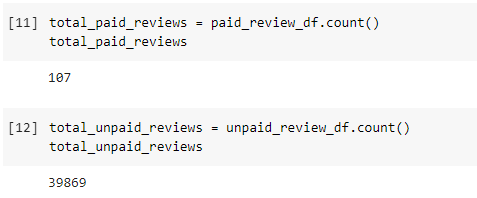
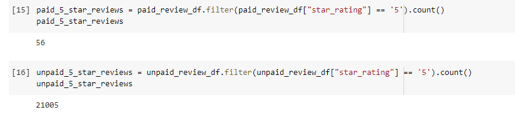
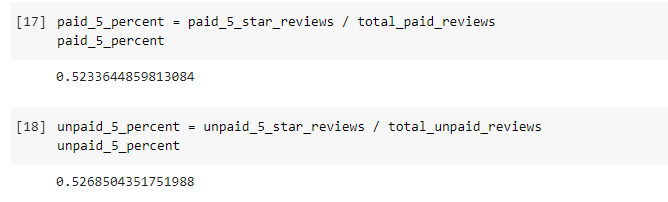

# Amazon_Vine_Analysis

## Overview
The purpose of this analysis is to analyze Amazon reviews written by member of the paid Amazon Vine program. Amazon Vine allows manufacturers and publishers to receive reviews for their products. I chose to analyze a dataset of items from the Outdoor category on Amazon, pulling information about the customer, product, review, and vine data. 

By breaking down the data into paid (Vine) and unpaid categories, we were able to determine if there was any bias between such types of reviews. 

## Results
For our Outdoors section, there was a total of 107 paid reviews and 39,869 unpaid reviews. 

There were 53 paid 5-star reviews from the Outdoors section, and 21,005 unpaid 5-star reviews. 

This means that about 52% of paid reviews were 5-stars. Funny enough, 52% of unpaid reviews on Outdoors items were also rated 5-stars. 

## Summary
Initially, I believed there would be a lot of positivity bias for paid reviews in the Vine program. Being paid is obviously going to effect how one portrays a product. However, in the Outdoors section, the percentage of unpaid reviews match the percentage of Vine reviews. This means that despite the bias that might affect Vine reviews, the Outdoor items are likely to be rated fairly, as genuine customers leaving unbiased reviews rate products 5-stars at the same rate as well. 

I believe that analyzing the other ratings (4-star, 3-star, etc) and comparing them with the 5-star data would give a clearer picture of the Vine program and if these ratings are affected by this service. 